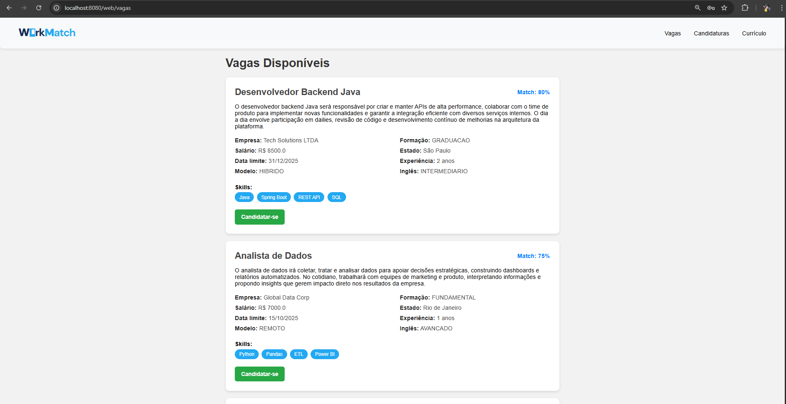
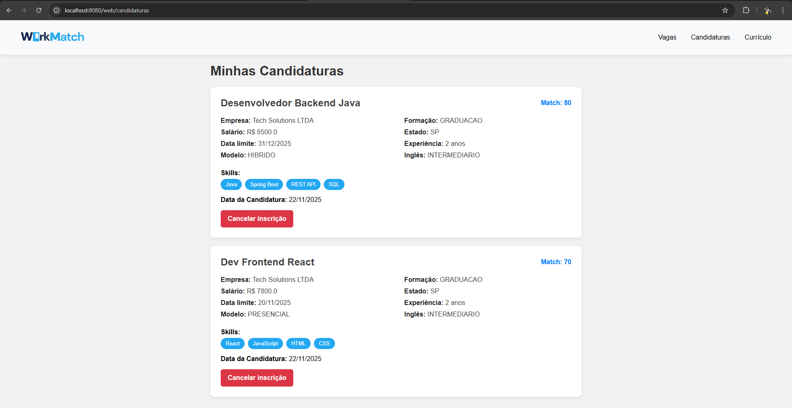
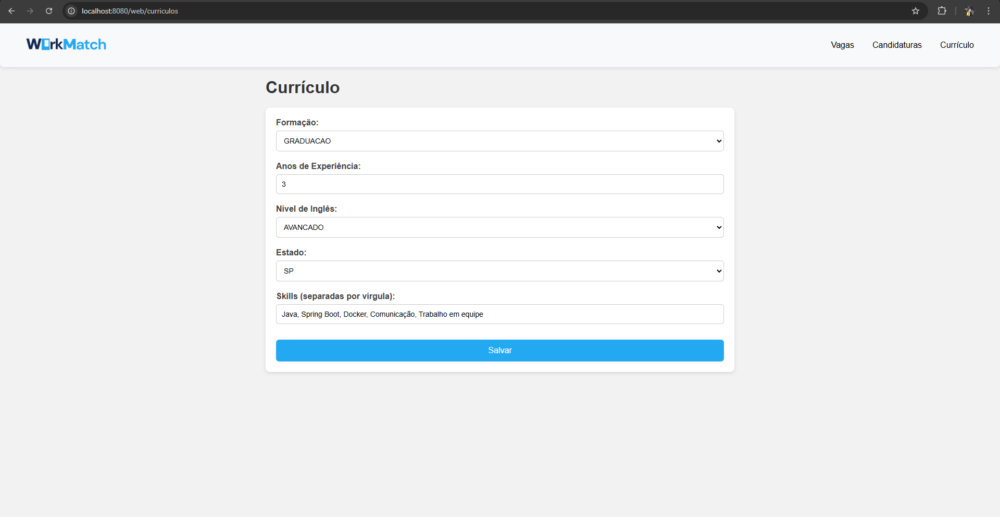
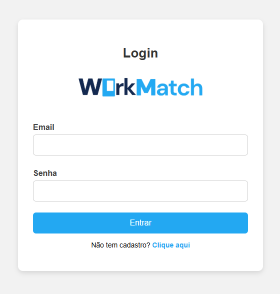
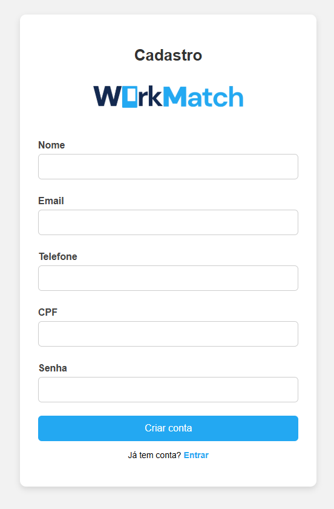
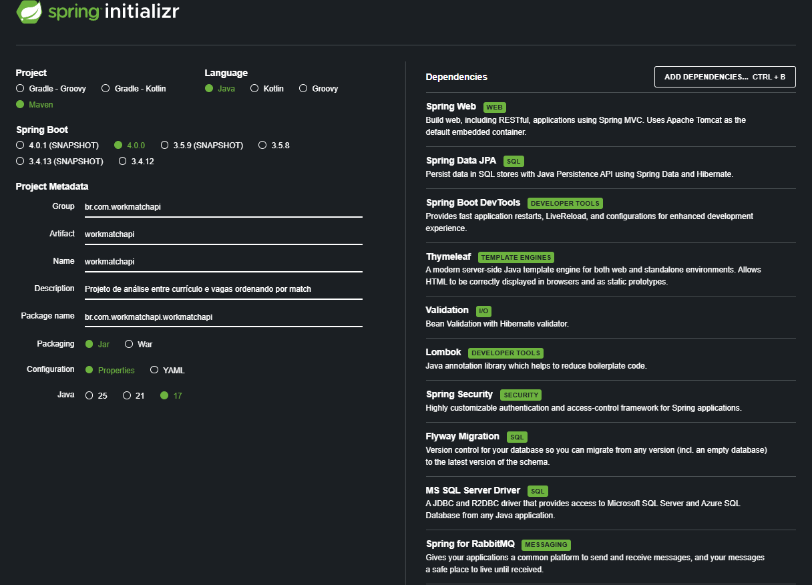
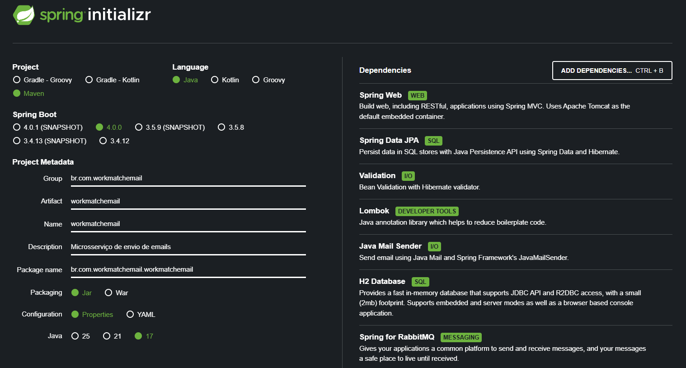

# WorkMatch

O Workmatch é uma plataforma de inteligência que analisa o seu perfil profissional e recomenda vagas com maior probabilidade de sucesso. 
Focada na etapa de triagem de currículos, a ferramenta considera habilidades, formação, experiência e outros dados do seu currículo para gerar indicações de vagas alinhadas ao seu perfil, tornando o processo seletivo mais eficiente e assertivo.

O projeto conta com dois serviços principais:

- API Java: regras de negócio, páginas web, responses HTTP, segurança, migrations,  
- Microserviço de notificações: envia e-mails para os candidatos sobre novas vagas via RabbitMQ.

--- 

## Telas da Aplicação







--- 

## Deploy da API

O deploy e o banco de dados estão na Azure. Acesse os links abaixo e coloque o endpoint no final.

- Para retornar páginas ``HTML``:
https://webapp-workmatch.azurewebsites.net/web/


- Para retornar em ``JSON``:
https://webapp-workmatch.azurewebsites.net/api/


## Acesso / Usuários

Existem duas Roles possíveis para um usuário:
- **ADMIN:** tem permissão pra fazer o CRUD completo e acessar todas as telas do sistema.
- **USER:** não tem permissão para criar Empresas e Vagas.

**Obs 1:** é possível criar um usuário ADMIN/USER pelo endpoint `/auth/register`, usando o seguinte JSON:

````json
{
    "nome": "Juliano Freitas",
    "email": "juliano@gmail.com",
    "telefone": "11987654323",
    "cpf": "12345678903",
    "senha": "123456",
    "role": "ADMIN"
}
````

Logo após, informe Email e senha em `/auth/login` para receber o Token JWT, que deverá ser usado nas próximas requisições como Bearer Token.
````json
{
    "email": "juliano@gmail.com",
    "senha": "123456"
}
````

**Obs 2:** ao registrar um novo usuário pela interface web, o mesmo receberá a Role de `USER` automaticamente. Não é necessário passar Bearer Token para os endpoints que retornam páginas HTML.






--- 

## Mensageria com RabbitMQ

Ao publicar uma vaga, o serviço de e-mail é acionado automaticamente. Ele coleta os endereços dos candidatos e envia notificações informando sobre a nova oportunidade.
A comunicação é gerenciada pelo RabbitMQ, hospedado na Cloud AMQP, e esse serviço funciona independente da API.

## Assistente IA

Ao acessar um endpoint `/ia/perguntar` e passar o parâmetro `texto`, é possível fazer perguntas para a IA do Ollama. Esse assistente está hospedado na nuvem, que processa as solicitações e retorna respostas inteligentes em tempo real.

Exemplo de requisição: 
````
/ia/perguntar?texto=Qual a melhor forma de estudar programação?
````

---

## Configuração dos Projetos

### 1. API

**Dependências:**
- Spring Web: Por se tratar de uma API Rest.
- Spring Data JPA: Acessar e manipular bancos de dados.
- Spring Boot DevTools: Recursos que ajudam na produtividade.
- Thymeleaf: Renderização de página HTML no navegador.
- Validation: Biblioteca de validação usada nos DTOs.
- Lombok: Gerar automaticamente códigos repetitivos (mais otimizado).
- Spring Security: Autenticação e acesso aos endpoints.
- JWT: Geração de Bearer Token.
- Flyway: Versionamento do banco de dados.
- MS SQL: SQL Server na Azure.
- Spring for RabbitMQ: Enviar evento para a mensageria.
- Spring AI (Webflux): Assistente de IA.

 
### 2. Microsserviço de Email

**Dependências (inéditas):**
- Java Mail Sender: Envio de Emails.
- Spring for RabbitMQ: Escutar fila da mensageria.

---

 
## Pacotes utilizados
 
### Arquitetura: MVC
 
**1. Model:**
- Entity → Mapeia tabelas e relacionamentos no banco.
- Enum → Padroniza tipos de atributos.
- Repository → Abstrai o acesso e consultas ao banco.
- Service → Implementa lógica e regras de negócio.
- Exception → Constrói exceptions personalizadas.
- DTO → Definição dos modelos de Request e Response de cada entidade.
- Mapper → Conversor de DTO para entidade e vice-versa.
- Security → Definição das regras de segurança e permissões.

**2. View:**
- Static → CSS e imagens.
- Templates → Fragmentos e Páginas HTML.
 
**3. Controller:**
- Controller HTTP → Expõe endpoints REST e manipula requisições/respostas.
- Controller WEB → Expõe endpoints e mapeia páginas WEB.
 
---

## Instruções para Executar o Projeto

1. Acesse o link de Deploy;
2. Adicione o endpoint desejado;
3. Todas as variáveis de ambiente já foram configuradas;
4. A aplicação já está configurada para usar um banco em nuvem, assim como o microsserviço de email;
5. Teste as requisições via Postman, Aplicativo Mobile ou Interface Web;

### Simulação de Uso

1. Crie um usuário ADMIN via requisição (com Role `ADMIN`) e com um email pessoal;
2. Use o JSON (final do Readme) para criar uma vaga nova;
3. Em alguns instantes aparecerá uma nova mensagem no seu email sobre a nova vaga (tanto recrutadores quanto candidatos são notificados).

---


## Endpoints
 
### JSON:
 
**1. Autenticação:**
| Método | URI              | Descrição                                |
| ------ | ---------------- | ---------------------------------------- |
| POST   | `/auth/login`    | Autentica um usuário e retorna um token. |
| POST   | `/auth/register` | Cadastra um novo usuário no sistema.     |

**2. Empresa:**
| Método | URI                  | Descrição                       |
| ------ | -------------------- | ------------------------------- |
| GET    | `/api/empresas`      | Lista todas as empresas.        |
| GET    | `/api/empresas/{id}` | Busca uma empresa pelo ID.      |
| POST   | `/api/empresas`      | Cria uma nova empresa.          |
| PUT    | `/api/empresas/{id}` | Atualiza uma empresa existente. |
| DELETE | `/api/empresas/{id}` | Deleta uma empresa pelo ID.     |

**3. Vaga:**
| Método | URI                    | Descrição                                       |
| ------ | ---------------------- | ----------------------------------------------- |
| GET    | `/api/vagas`           | Lista todas as vagas.                           |
| GET    | `/api/vagas/paginacao` | Lista vagas com paginação (`pagina` e `itens`). |
| GET    | `/api/vagas/trabalho?modelo=`  | Lista vagas por modelo de trabalho.     |
| GET    | `/api/vagas/{id}`      | Busca uma vaga pelo ID.                         |
| POST   | `/api/vagas`           | Cria uma nova vaga.                             |
| PUT    | `/api/vagas/{id}`      | Atualiza uma vaga existente.                    |
| DELETE | `/api/vagas/{id}`      | Deleta uma vaga pelo ID.                        |

**4. Usuário:**
| Método | URI                  | Descrição                      |
| ------ | -------------------- | ------------------------------ |
| GET    | `/api/usuarios`      | Lista todos os usuários.       |
| GET    | `/api/usuarios/{id}` | Busca um usuário pelo ID.      |
| PUT    | `/api/usuarios/{id}` | Atualiza um usuário existente. |
| DELETE | `/api/usuarios/{id}` | Deleta um usuário pelo ID.     |

**5. Candidatura:**
| Método | URI                      | Descrição                           |
| ------ | ------------------------ | ----------------------------------- |
| GET    | `/api/candidaturas`      | Lista todas as candidaturas.        |
| GET    | `/api/candidaturas/{id}` | Busca uma candidatura pelo ID.      |
| POST   | `/api/candidaturas`      | Cria uma nova candidatura.          |
| PUT    | `/api/candidaturas/{id}` | Atualiza uma candidatura existente. |
| DELETE | `/api/candidaturas/{id}` | Deleta uma candidatura pelo ID.     |


### HTML:

| Página       | Método | URI          | Descrição        |
| ------------ | ------ | ------------ | ---------------- |
| Login        | GET    | `/web/login` | Página de login. |
| Cadastro     | GET    | `/web/cadastro` | Página de cadastro de usuários.    |
| Vagas        | GET    | `/web/vagas` | Página com todas as vagas cadastradas. |
| Candidaturas | GET    | `/web/candidaturas`  | Página com todas as candidaturas do usuário. |
| Currículo    | GET    | `/web/curriculos` | Editar ou cria um currículo novo se não existir. |


---

## Exemplos de Requisições
 
- Exemplo de Request **Empresa**:
````json
{
    "nome": "Tech Fit LTDA",
    "cnpj": "12345678901232",
    "email": "contato@techsolutions.com",
    "telefone": "11990074564"
}
````

- Exemplo de Request **Vaga**:
````json
{
    "cargo": "Desenvolvedor Full Stack Júnior",
    "salario": 8000.50,
    "dataFim": "2025-12-12",
    "experiencia": 2,
    "nivelIngles": "INTERMEDIARIO",
    "modeloTrabalho": "REMOTO",
    "formacao": "GRADUACAO",
    "estado": "SP",
    "match": 50,
    "skills": [
        "Java",
        "Spring Boot",
        "Docker",
        "Comunicação"
    ],
    "descricao": "O desenvolvedor full stack será responsável por criar e manter APIs, trabalhar na evolução da arquitetura do sistema e colaborar com outras equipes para entregar soluções escaláveis. No dia a dia participará de reuniões de alinhamento, revisões de código e implementação de novas funcionalidades.",
    "empresaId": 1
}
````

- Exemplo de Request **Usuário**:
````json
{
    "nome": "Juliano Freitas",
    "email": "celia1432@uorak.com",
    "telefone": "11987654323",
    "cpf": "12345678903",
    "senha": "123456",
    "role": "ADMIN"
}
````

- Exemplo de Request **Currículo**:
````json
{
    "formacao": "GRADUACAO",
    "experiencia": 3,
    "nivelIngles": "INTERMEDIARIO",
    "estado": "SP",
    "skills": [
        "Java",
        "Spring Boot",
        "Docker",
        "Comunicação",
        "Trabalho em equipe"
    ],
    "usuarioId": 1
}
````

- Exemplo de Request **Candidatura**:
````json
{
    "vagaId": 2,
    "curriculoId": 1
}
````

---

## Autor

Desenvolvido por **Eduardo Guilherme Dias**

[ [LinkedIn](https://www.linkedin.com/in/eduardo-gdias/) |  [GitHub](https://github.com/eduardogdias) ]